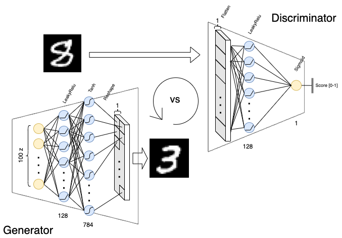
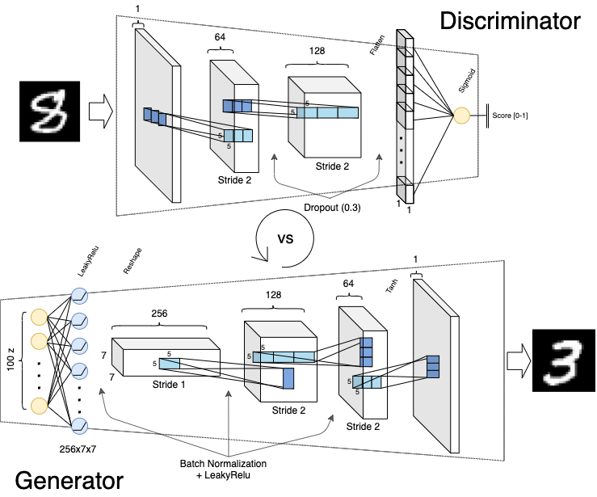
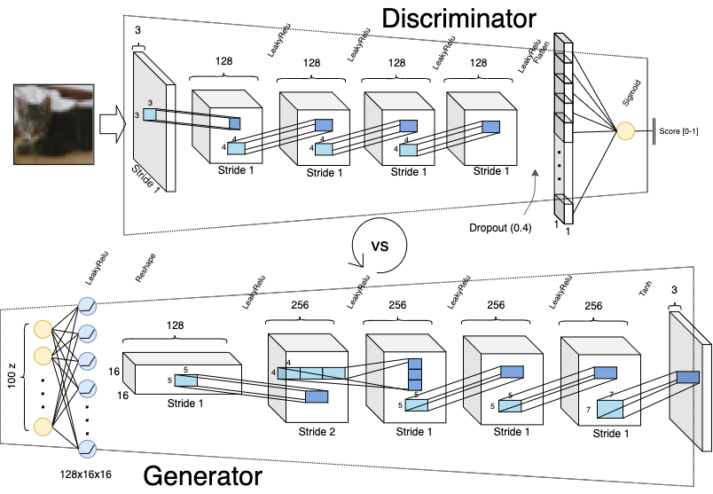

# Generative Adversarial Networks
Generative Adversarial Networks (GANs) are a powerfull class of generative models. Despite their successes, the most appropriate choice of network architecture is still not well understood. GAN models for image synthesis have adopted a deep convolutional network architecture, which eliminates or minimizes the use of fully connected and pooling layers in favor of convolution layers in the generator and discriminator [3]. During this work we evaluate three different GAN architectures implemented with Keras framework in Python. The analysis is splitted in three parts, (1) using **Multilayer Perceptron models** (fully connected architecture) for Generator and Discriminator on MNIST data, (2) using a hybrid arcuitecture, with a small Fully-connected part and a **Convolutional Neural Network** (CNN) block for both, Generator and Discriminator on MNIST data, and (3) using a **deeper Convolutional Neural Network** on images of cats from CIFAR10 dataset.

## MLP architecture
MNIST dataset is used to train a Generative Adversarial model with fully connected architecture for both, generator and discriminator models, see architecture in Fig. 1 [1].

\
Fig. 1 - Multilayer Perceptron GAN architecture.

## CNN for MNIST
Since existing research usually deploys CNNs for image synthesis tasks in GANs (CGAN), minimizing the use of fully connected and pooling layers, Convolutional Neural Network for generator and discriminator are used this time in the GAN’s architecture, see architecture in Fig. 2 [1].

\
Fig. 2 - Convolutional Neural Network GAN architecture for MNIST.

## Deeper CNN for CIFAR10
Cat images from CIFAR10 cat category are used to evaluate this model. For this, a deeper Convolutional Neural Network with a Fully Connected layer at the beginning is used, see architecture in Fig. 3 [1].

\
Fig. 3 - Deeper Convolutional Neural Network GAN architecture for CIFAR10.

## Cite this work
    J. Rico, (2019) Deep Learning in Computer Vision - GANs
    [Source code](https://github.com/jvirico/GANs_Keras)

## References
[1] - [Deep Learning in Computer Vision - Generative Adversarial Networks](Report.pdf).\
[2] - [UBx, Bordeaux, France. Deep Learning in Computer Vision](http://ipcv.eu/blog/course/deep-learning-in-computer-vision/).\
[3] - S. Barua, S. M. Erfani, and J. Bailey, “Fcc-gan: A fully connected and convolutional net architecture for gans,” arXiv preprint arXiv:1905.02417, 2019.